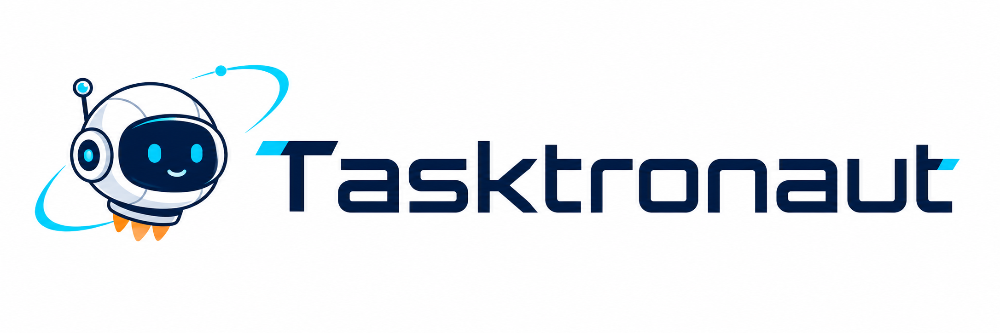
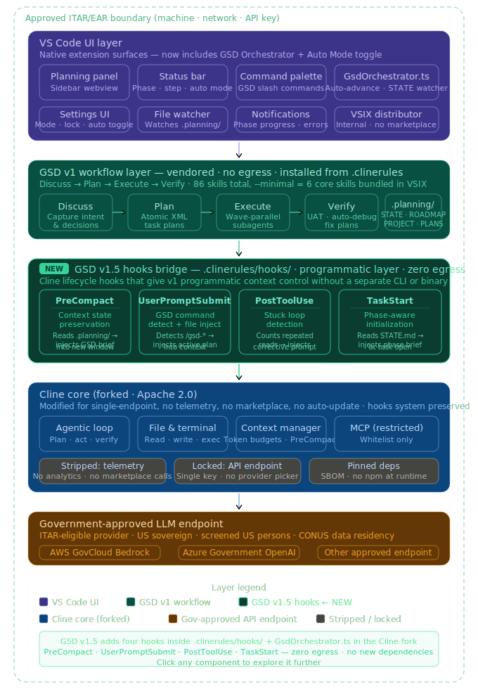

# Tasktronaut

Tasktronaut is a VS Code extension project that combines a hardened Cline fork with the Get Shit Done workflow system for controlled engineering environments. It is intended for internal NASA-oriented workflows where the machine, network, and model endpoint are already approved, and the extension must stay inside that boundary without adding unnecessary egress or operational risk.

> Tasktronaut is a project codename for an internal tool. It is not an official NASA product or endorsement.

## Overview

Tasktronaut is built from three layers:

- **Cline** for the extension runtime, agent loop, file editing, terminal execution, browser actions, and approval flow
- **Get Shit Done** for planning structure, phased execution, and verification discipline
- **A thin bridge layer** that uses hooks and extension logic to make the workflow durable inside long-running agent sessions

The intent is to keep the proven strengths of both upstream projects while removing the pieces that do not fit an internally managed deployment model.

## Design Goals

- Keep the extension inside a single approved API path
- Remove non-essential outbound surfaces such as telemetry, account services, and public marketplace dependencies
- Preserve human approval for consequential actions
- Make planning state survive context compaction and long tasks
- Package the result as a predictable internal VSIX

## Architecture Direction

The current direction is a lightweight hybrid model referred to in the design notes as **GSD v1.5**:

- keep **Cline** as the extension runtime
- use **GSD v1** as the workflow layer
- add a small programmatic bridge where prompt-only orchestration is not sufficient

For the multi-agent orchestration layer, the current recommendation is a **standalone Tauri desktop app** rather than a VS Code webview. The prototype work that informed this direction is intentionally kept outside the shareable repository history.

This approach was chosen over a standalone orchestration replacement because it keeps the integration surface smaller, fits better with the existing extension model, and aligns with a controlled deployment environment.

### Bridge Layer Responsibilities

The bridge layer focuses on four specific problems:

1. Preserving planning state across context compaction
2. Injecting the active planning artifacts when a workflow phase is triggered
3. Detecting repeated low-value loops
4. Supporting more reliable phase progression

## System View

At a high level, Tasktronaut is intended to operate as:

`VS Code UI -> hardened Cline core -> bundled GSD workflow layer -> approved model endpoint`

## Hardening Scope

The fork plan currently centers on the following changes to the base extension:

- remove telemetry rather than relying on configuration flags
- remove account and billing flows tied to external services
- lock provider configuration to the approved environment
- disable or replace marketplace-style MCP discovery
- disable remote update and remote feature configuration behavior
- bundle the required GSD assets into the shipped extension

The steady-state deployment model is intentionally narrow:

`developer machine -> Tasktronaut -> approved API key -> approved endpoint`

## Repository Layout

This workspace currently contains the two upstream foundations for the project:

- [tasktronaut](./tasktronaut)
- [get-shit-done](./get-shit-done)

The root of this repo is the integration layer and documentation surface for the combined system.

## Near-Term Work

1. Harden the Cline fork for internal deployment.
2. Lock the provider and configuration model.
3. Bundle the GSD assets required for the intended workflow.
4. Implement the hook-based bridge behaviors.
5. Add the Tasktronaut product surface and package the extension as a VSIX.

## Visual Identity

The current brand exploration is captured in [assets/tasktronaut-brand-pack.png](./assets/tasktronaut-brand-pack.png). It is not part of the product surface yet, but it establishes the direction for the sidebar icon, wordmark, and supporting graphics.

## Attribution

Tasktronaut builds on upstream open-source projects that should remain clearly credited:

- **Cline**, licensed under Apache 2.0
- **Get Shit Done**, licensed under MIT
